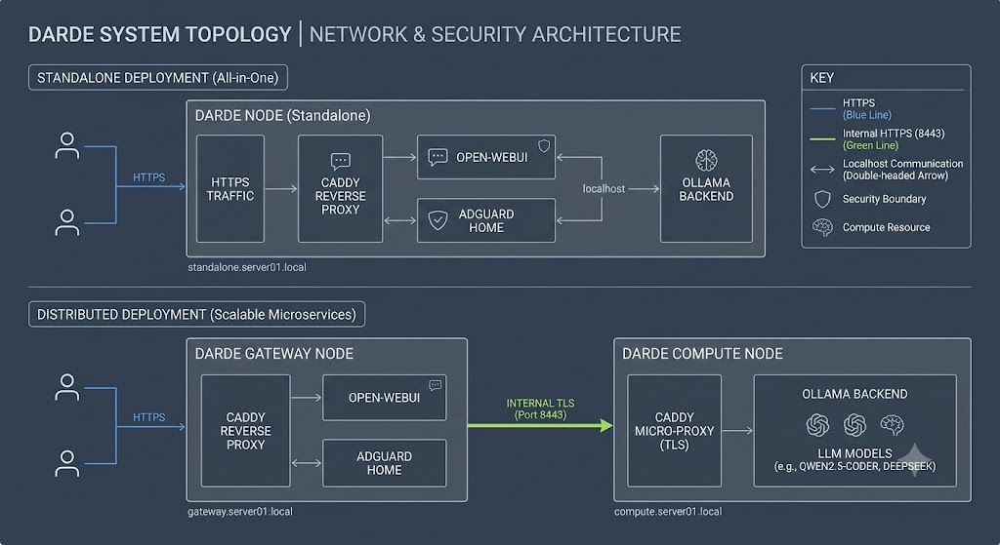

# DARDE - Dynamic AI Rapid Deployment Environment

## Overview
**DARDE** is an enterprise-grade, locally-hosted Artificial Intelligence orchestration platform. Designed with a microservices architecture and a Zero-Trust security model, DARDE allows system administrators and developers to rapidly deploy, manage, and scale Large Language Models (LLMs) and their associated front-end interfaces within a secure LAN environment.

## Core Purpose
The primary goal of DARDE is to bridge the gap between experimental AI setups and production-ready infrastructure. It abstracts the complexity of container management, network routing, and encrypted communications, providing a unified ecosystem where AI workloads can operate seamlessly and securely without relying on external cloud providers.

## Key Advantages
* **Zero-Trust Security:** Internal traffic between nodes is secured via an automated HTTPS micro-proxy (TLS), ensuring that sensitive data and AI prompts are never transmitted in plaintext across the local network.
* **Dynamic Topology & Auto-Discovery:** Automated generation of base domains (e.g., `ai.master.server01.local`) and intelligent container routing based on the specific physical machine's assigned role.
* **Resource Isolation:** Granular control over where computational heavy-lifting occurs, preventing UI or Gateway bottlenecks during intensive LLM processing.
* **Plug-and-Play Client Integration:** Automated client-side scripts (Windows/Linux) handle certificate injection, DNS routing (`/etc/hosts`), and Python virtual environment sandboxing for immediate API access.
* **IDE Integration:** Native support for external tools (e.g., VS Code via Continue.dev) to enable real-time AI pair programming, utilizing the secure local backend.

## Architectural Topology
DARDE is built to scale. It can be deployed on a single machine for testing or distributed across multiple physical servers for high availability and load balancing. During the initial setup, administrators can assign one of three specific roles to a node:

### 1. Standalone (All-in-One)
Ideal for powerful local workstations or initial testing.
* **Function:** The node handles everything—Network Routing, SSL Termination, DNS Firewall, WebUI Frontend, and the Ollama AI Backend.
* **Use Case:** Single-server environments with adequate RAM and GPU resources.

### 2. Gateway Node
The traffic director and user-facing frontend.
* **Function:** Runs only the lightweight components: Caddy Reverse Proxy, AdGuard Home (optional DNS), and Open-WebUI.
* **Behavior:** It does not load AI models into memory. Instead, it securely routes user queries via HTTPS to an external Compute Node on the LAN.
* **Use Case:** Low-power mini-PCs or Raspberry Pis acting as the entry point for the network.

### 3. Compute Node
The heavy-lifting AI worker.
* **Function:** Runs the Ollama LLM backend and a hardened Micro-Proxy.
* **Behavior:** Has no public-facing UI. It listens exclusively on a secure local port (`8443` via HTTPS) and processes incoming API requests from the Gateway Node.
* **Use Case:** Dedicated GPU rigs or high-RAM servers isolated in the server room.

## Getting Started
To initialize the DARDE infrastructure, run the `main.py` entry point on your Linux server. The built-in Setup Wizard will guide you through selecting the node's topology, configuring the dynamic domain names, and deploying the appropriate container stack.

## Architectural Topology

The DARDE infrastructure is designed to be highly flexible and resilient, supporting both single-node deployments and distributed multi-node clusters.

*Figure 1: DARDE System Topology and Network Security Architecture.*